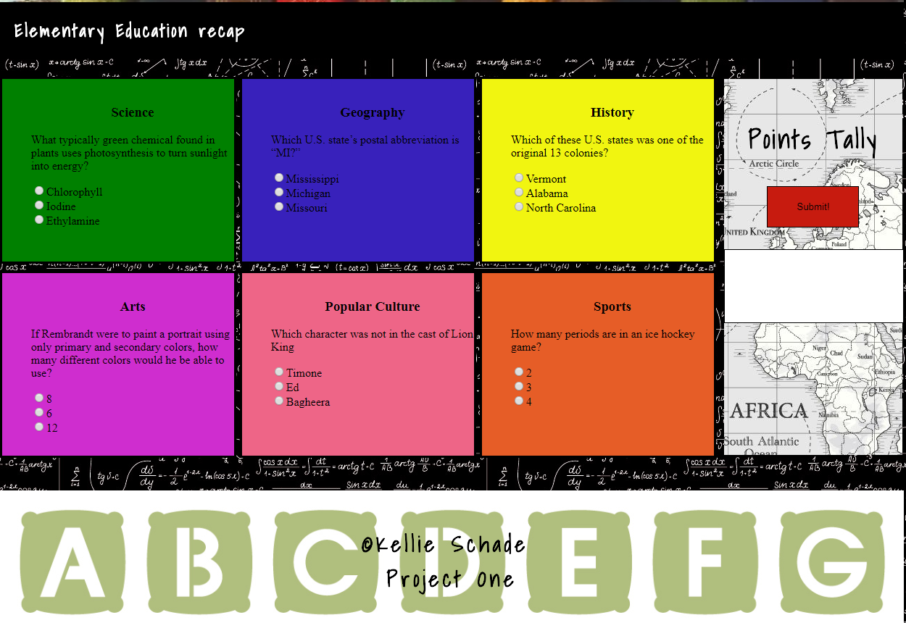
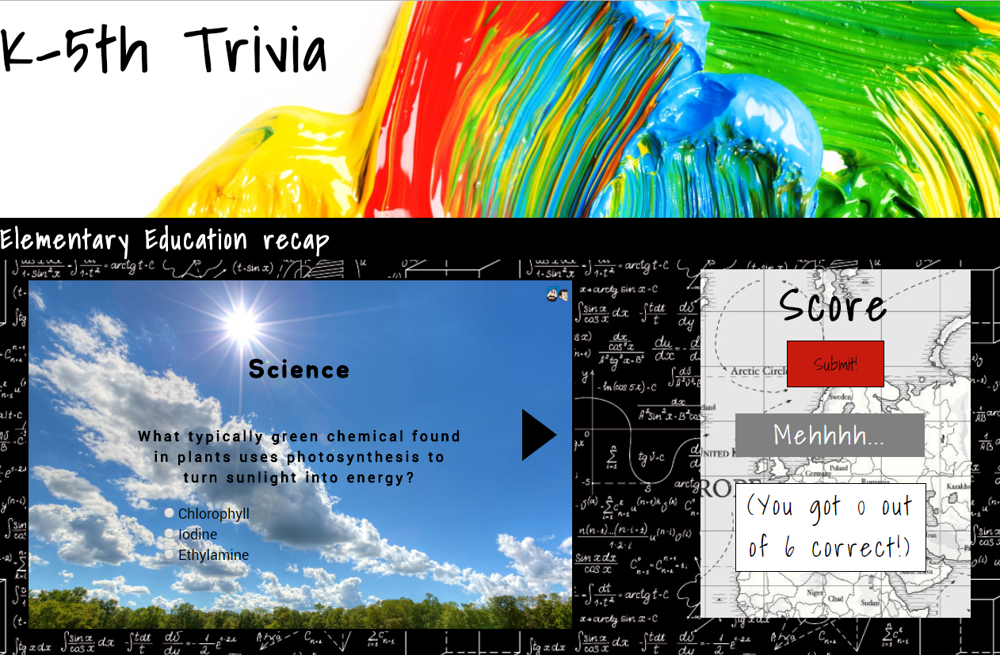

## ProjectOne K-5 Trivia Game
K-5 trivia is an elementary themed one player trivia game. Each user selected answer is tracked throughout and a score is displayed after user elects to submit their responses.

Keep your 5th grade audience in mind!! Game should gain and retain a 5th graders attention. Use colorful graphics and present a simple layout. 

##### Mockup:

##### Mockup

## Code Style
Form style to keep score and Vanilla JavaScript

## Code Example 
function check() {
  var question1 = document.quiz.questionOne.value;
  var question2 = document.quiz.questionTwo.value;
  var question3 = document.quiz.questionThree.value;
  var question4 = document.quiz.questionFour.value;
  var question5 = document.quiz.questionFive.value;
  var question6 = document.quiz.questionSix.value;

  //starting score is 0
  var correct = 0;

  // if value equals answer add one point to the total
  if (question1 == "Chlorophyll") {
    correct++;
  }

  if (question2 == "Michigan") {
    correct++;
  }
  if (question3 == "northCarolina") {
    correct++;
  }
  if (question4 == "6") {
    correct++;
  }
  if (question5 == "Bagheera") {
    correct++;
  }
  if (question6 == "3") {
    correct++;
  }
  document.getElementById("message").innerHTML = messages[score];
  document.getElementById("number_correct").innerHTML =
    "(You got " + correct + " out of 6 correct!)";

##Deployment
App is deployed at https://kschade.github.io/projectOne/

##Local Install
$ git clone https://github.com/KSchade/K-5-Trivia.git
cd K-5-Trivia.git
code .

### Useful Resources

- [HTML5 Validator](https://html5.validator.nu/)
- [CSS Validator](https://jigsaw.w3.org/css-validator/#validate_by_input)

## Goals

- When an answer is selected the game should track each response.
- If a question is left blank or incorrect the user should not get credit. 
- After clicking submit the user should see their final score.
- A message should display after user clicks submit.
- Have 3 different messages dependent on the users score 1-2"Mehhh...", 3-4"Not Bad :)", 5-6"Awsome Job!".
- When code is refreshed all questions are reset.
 

## Bonus Goals
- Each question is presented one at a time.-- slide show.
- When page is visited the first question should display
- First slide should only be able to select next.
- When user clicks next the following slide should appear
- previous and next arrows should appear on slides 2-5
- on last slide only a previous arrow should appear.
- If the page is not refreshed selected answers should retain if user clicks previous.
- User should only see slides, after game has completed they should not see the background. 
- If page is refreshed all answers are cleared. 

